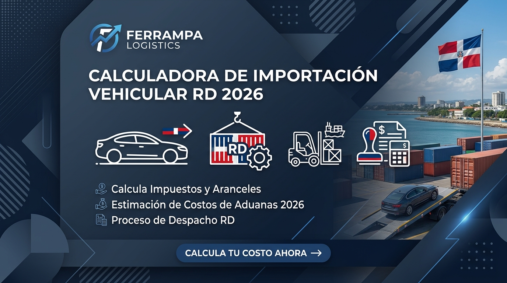

# 🚗 Ferrampa Logistics - Calculadora de Importación Vehicular RD



**Ferrampa Logistics** es una plataforma profesional diseñada para simplificar el cálculo de impuestos de importación de vehículos en la República Dominicana (2026). Optimizado para el cumplimiento de la **Ley 103-13** (Incentivos Eco) y el tratado **DR-CAFTA**.

---

## 🌟 Características Principales

* **Decodificación de VIN (NHTSA API):** Obtiene automáticamente marca, modelo, año y tipo de motor a partir del chasis.
* **Cálculos de Impuestos Precisos:** Calcula Arancel, ITBIS, Impuesto de Placa y Servicios Aduaneros basados en las leyes vigentes.
* **Modo Automático Inteligente:** Fija automáticamente el Seguro (2%) y Flete (15%) basado en el valor FOB.
* **Soporte Multi-Vehículo:** Permite cotizar múltiples vehículos de forma simultánea con gastos compartidos.
* **Exportación Profesional:** Genera reportes detallados en PDF para trámites comerciales.
* **Diseño Moderno:** Interfaz 100% responsiva con soporte nativo para **Modo Oscuro**.

## 🛠️ Tecnologías Utilizadas

* **Frontend:** HTML5, Tailwind CSS, JavaScript (ES6+ Modules).
* **Librerías:** * [Chart.js](https://www.chart.js.org/) para visualización de costos.
    * [jsPDF](https://github.com/parallax/jsPDF) para la generación de reportes.
* **SEO & Analytics:** Estructura optimizada con `sitemap.xml`, `robots.txt` y soporte para Google AdSense.

## 📂 Estructura del Proyecto

```text
Calculo Vehiculos/
├── css/            # Estilos personalizados y variables de tema
├── js/             # Lógica de cálculo, UI y constantes
├── img/            # Recursos visuales y Open Graph
├── index.html      # Aplicación principal
├── guia-*.html     # Contenido educativo y SEO
└── sitemap.xml     # Mapa del sitio para indexación

⚖️ Cumplimiento Legal
Este software procesa datos técnicos localmente y cumple con la Ley No. 172-13 de Protección de Datos de República Dominicana. Los cálculos son estimaciones referenciales; la liquidación oficial es emitida exclusivamente por la Dirección General de Aduanas (DGA).

📧 Contacto
Desarrollado por: Ferrampa Logistics

WhatsApp: +1 (809) 415-0116

Email: info.aduanasenlinea@gmail.com

Web: ferrampalogistics.com

Contacto Desarrollador: orlandoamparoperalta@gmail.com

© 2026 Ferrampa Logistics. Todos los derechos reservados.
